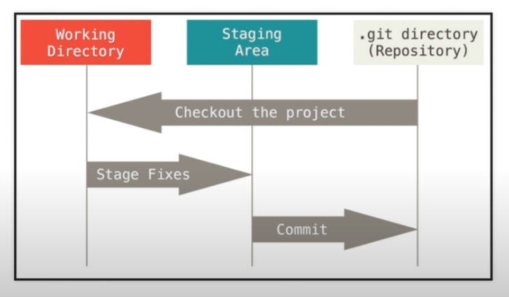

## Git & Github

## Git

- Git is a distributed version control system for tracking changes to source code made while developing
- the entire codebase/history of a project is available on a developer's computer as a local repository

## Github

- cloud-based git repository hosting service
    - other popular git hosting services include GitLab, Bitbucket, and SourceForge
- git is the command line tool for working with local repositories, Github is a web-based UI that allows us to work with remote repositories

## Ways to Start a Project with Git

- if we have an existing remote repository, we can clone it so that we have a copy of that repository locally
- if we have an existing or blank project locally, we can initialize a git repository inside of it
- if someone else has an existing remote repository, we can fork it (giving ourselves our own copy of that remote repository) and clone it to get a local copy of our forked repository

## Initializing Repositories Locally

- we initialize by running the `git init` command in teh directory (folder) that we want to create the repository in
- this command will create a `.git` directory within our current directory
    - this `.git` directory is the local repository - it stores information including the commits we've made, the URLs of any connected remote repositories, our codebase as it was in the most recent commit, the history of our codebase, etc.

## Terms

- Working Directory
    - contains files that git is not currently tracking and files that have been modified since the last commit to the local repository
- Staging Area
    - contains the files that we've staged (i.e. prepared to commit), but haven't yet committed to the local repository
- Local Repository
    - contains files as they were in the most recently made commit

## How Git Works

- git doesn't know proper programming language syntax
- but it does know when things change
- after we initialize a local repository, git begins tracking all the files within that repository
    - we can use the `.gitignore` file to specify files/folders that git shouldn't track 
    - in this file, we specify the filenames/folder names of any files/folders we don't want git to track
    - the untracked files won't be staged or committed to any local or remote repositories
    - we want to ignore files with sensitive information (i.e. files storing API credentials) or unnecessary files (i.e. local configuration files)
- whenever a change is made to a tracked file, git keeps track of that in the wworking directory
    - this change can be anything - something trivial like a newline, or something non-trivial like additional code
- after we stage and then commit our changes, the cycle begins again
    - so when a change is made after this new commit, git will track it in the working directory

## Staging Changes Locally

- we stage changes (i.e. moving them to the Staging Area) with the `git add` command
- after this command, we can specify the file(s) that we want to stage
- if we want to stage every file in the working directory (every file that's changed since the previous commit), we'll use `git add .`

## Committing Locally

- we commit changes from the Staging Area to our local repository with the `git commit` command
- after this command, we can specify the file(s) that we want to commit
- if we want to commit all staged files, we simply exclude any file/folder names following the command (i.e. `git commit`)
- when making a commit, we should include the `-m` flag following our command and follow this flag with a commit message in quotes to explain the changes that we've made
- if we don't include the `-m` flag, our default text editor will open to prompt us to enter a commit message

## Pushing Changes to a Remote Repository

- once we've changed our commited our changes locally, we can push them to our remote repository with `git push`
- if we've set up branch tracking, we don't need to include any flags/arguments following this command (our local commits will be pushed to the tracked branch on the remote repository)
- if we haven't set up branch tracking, we follow the command with the name of the repository that we're pushing to and the branch on that repository (e.g. `git push -u origin main`)

## Git Branching

- when we initialize a git repository, the `git init` command creates a default master/main branch
    - this branch is to meant to hold our production-ready code
    - this allows us to use this branch as a source of truth
- we can think of our branches as a timeline of our project that get updated with each commit to a branch
- when creating a new branch, we're effectively taking a snapshot of the source branch (i.e. the branch that we're basing our new branch off of)
    - we can then we can develop new features without worrying about breaking our source of truth
- oftentimes, we'll follow a feature branch workflow, where we'll create a new branch for each new feature that's being developed
    - once the feature has been finished and tested, we can merge the branch back into our source branch to add our changes to the source branch

### Creating New Branches

- we create local branches with the git branch command (e.g. `git branch nameOfBranch`)
- the branch that we're in when we run this command will be the source branch for our new branch
- if we run the `git branch` command without any arguments, it will list all of the branches in our repository

### Switching Branches

- we can switch branches locally with the `git checkout` command (e.g. `git checkout branchToSwitchTo`)
    - if we have any staged but uncommited changes, we'll need to commit or stash them before we can switch branches
- we can create a new branch and switch to it with a single command by using the `git checkout` command and the `-b` flag (e.g. `git checkout -b nameOfNewBranch`)
- we can also switch branches with the `git switch` command (e.g. `git switch branchToSwitchTo`)

## Working with Remote Repositories

- there are four commands that cause our local directory to communicate with a remote repository
    - `git clone`
    - `git fetch`
    - `git pull`
    - `git push`

### Cloning Remote Repositories

- to clone a remote repository, we follow the `git clone` command with the URL that the repository is hosted at
- when we clone a remote repository, it
    - creates a directory with the same name as the remote repository in the directory that we ran `git clone` in
    - initializes a new local repository in this new directory
    - makes a copy of the branches of the remote repository
    - adds the remote repository address to our local repository with the alias `origin`
    - sets up tracking between the `main`/`master` branch of the local and remote repositories (so we can use `git push` by itself without any arguments/parameters)
        - we can also set up tracking between a local and remote branch with the `-u` flag in the `git push` command

### Fetching from Remote Repositories

- the `git fetch` command downloads changes from a remote repository, but doesn't commit those to our local repository
- we can use this command to, e.g. download all branches from the remote repository to see which branches the repository contains without local copies of each of those branches created

### Pulling from Remote Repositories

- the `git pull` command both fetches (i.e. downloads) and commits the remote changes to our local repository
- we need to run `git pull` before we can push to a remote repository if the remote repository has any changes that we don't have locally